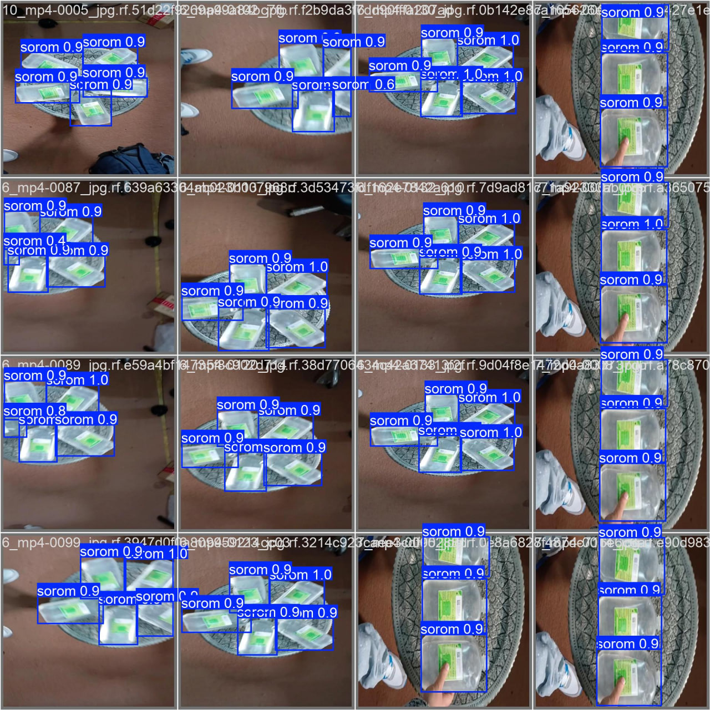

# Serum Count Detection with Python 🧪

This project demonstrates how to use machine learning to detect the number of serum vials in images. It leverages **Roboflow**, **Google Colab**, **VSCode**, and **Python** to build an object detection model.

## Project Overview

In this repository, you will find:
- A Python script for training and testing the model.
- A `.pt` file for the trained model.
- Instructions on how to use the model for detecting serum vials in images.

### Tools & Technologies Used
- **Python**: Programming language used for model training and implementation.
- **Roboflow**: Used for dataset preparation, annotation, and model training.
- **Google Colab**: Cloud-based platform for training the object detection model.
- **VSCode**: Code editor for writing and managing Python scripts.

### How to Use

1. **Clone the Repository:**

   ```bash
   git clone https://github.com/HamidrezaKhosravizadeh/YOLO.git
   cd serum-count-detection
   ```

2. **Install Dependencies:**

   Make sure you have Python 3.x installed, and then install the required libraries:

   ```bash
   pip install -r requirements.txt
   ```

3. **Prepare the Dataset:**
   - Use **Roboflow** to upload and annotate your serum vial images.
   - Export the dataset in COCO or YOLO format for training.
   - If you have already prepared the dataset using Roboflow, you can skip this step.

4. **Training the Model:**
   - Upload the dataset to **Google Colab** and run the training code to train the object detection model.
   - Alternatively, you can run the training code on your local machine if you have the necessary resources.

5. **Testing and Predictions:**
   - After training, use the model to detect serum vials in new images. 
   - Run the provided `detect.py` script with your image input.

   Example usage:

   ```bash
   python detect.py --image_path your_image.jpg
   ```

6. **Model Deployment:**
   - The trained model file (`best.pt`) is included in this repository. You can use it for further development or integrate it into a larger system.

### Directory Structure
```
serum-count-detection/
│
├── detect.py          # Script to detect serum in images
├── requirements.txt         # Required Python dependencies
├── best.pt                # Trained model file
└── README.md                # Project documentation
```
### Install 
```
│
├── tensorflow==2.10.0
├── numpy==1.23.4
├── opencv-python==4.6.0.66
├── pillow==9.2.0
├── matplotlib==3.6.1
├── roboflow==1.0.0
├── flask==2.2.2
├── requests==2.28.1
├── pyyaml==6.0
├── scikit-learn==1.1.2
└── ultralytics==8.0.0
```
### Contributing

Feel free to fork this repository, make improvements, and submit pull requests. Contributions are welcome!

### License

This project is licensed under the YOLO License.

---

# the result:

[1]:



[2]:


[3]:


[4]:


[5]:


